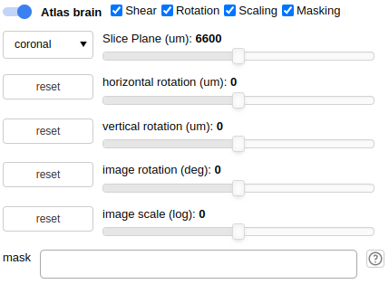
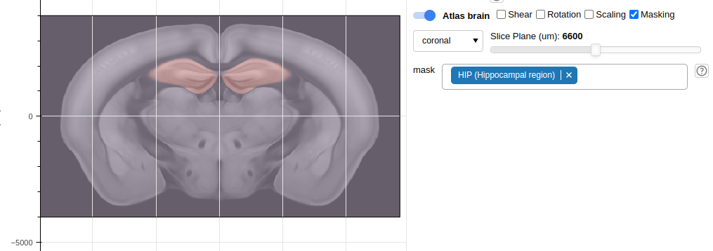

.. _atlas:

Atlas Mouse Brain
=================

Require optional dependency `bg-atlasapi`_.

.. _bg-atlasapi: https://github.com/brainglobe/bg-atlasapi

Install
-------

::

    pip install bg-atlasapi

Commandline options
-------------------

use ``--atlas`` to specific which atlases.
You can use ``bg_atlasapi.show_atlases()`` to show all available atlases.
For the mouse brain atlases, you can give ``--atlas=25`` to specific use ``allen_mouse_25um`` atlas.

For the **first** running, it needs to download the corresponding atlas for a while.

By default, the atlas view will show once the correspond package is installed.
If no, use ``--view=atlas`` in command-line.

Application View
----------------

Once `bg-atlasapi` installed, you can find a brain slice shown in the middle figure.

Controls
~~~~~~~~

*   Moving

    On Figure toolbar |figure-toolbar|, select |bk-tool-icon-box-edit|.

    Use mouse cursor to drag the image.
    You can see a boundary of image is following your movement.
    Once you release the mouse button, the atlas image will update to the new position.

*   Other controls

    |atlas-controls|

    *   Slice view: change between ``coronal``, ``sagittal`` and ``transverse``.
    *   Slice plane: change the slice plane.
    *   Shear: change the horizontal or vertical plane difference.
    *   Rotation: rotate the image. (we rotate the content of the image instead of the image due to the technique issue.)
    *   Scaling: scale the image.
    *   Masking: add color shadow on the corresponding regions.

        |atlas-mask|

.. |bk-tool-icon-box-edit| image:: _static/bk-tool-icon-box-edit.png

Configurations
--------------

It is saved in the configuration besides a corresponding channelmap file. It is looked like::

    {
      "AtlasBrainView": {
        "atlas_brain": "allen_mouse_25um",
        "brain_slice": "coronal",
        "slice_plane": 264,
        "slice_rot_w": 0,
        "slice_rot_h": 0,
        "image_dx": 0.0,
        "image_dy": 0.0,
        "image_sx": 1.0,
        "image_sy": 1.0,
        "image_rt": 0.0
      }
    }

