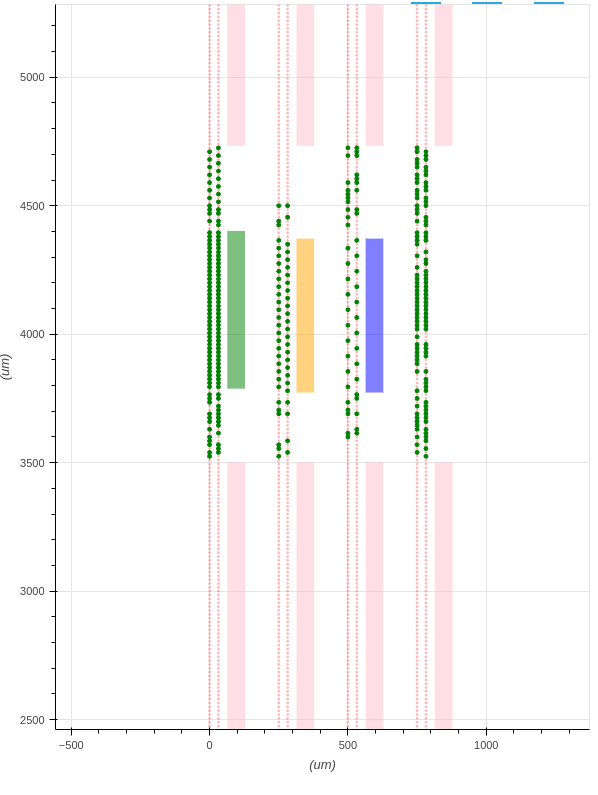

Blueprint View
==============

Show blueprint beside the probe.

Electrode Category value colors:

* green: pre-selected, full-density
* orange: half-density
* blue: quarter-density
* transparent: low-density, unset
* pink: forbidden

Commandline options
-------------------

It is enable by default.
If no, use ``--view=blueprint`` in command-line.

