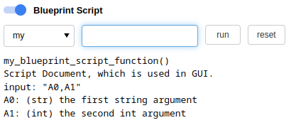

Blueprint Script View
=====================

**It is an experimental feature.** Run custom script.

Commandline options
-------------------

use ``--view=script`` to enable.

Create an external script
-------------------------

Please check the file ``tests/bp_example.py``

.. literalinclude:: _static/bp_example.py
   :language: python
   :lines: 20-32

Configurations
~~~~~~~~~~~~~~

It uses user config. To add above example::

    {
      "BlueprintScriptView": {
        "actions": {
          "my": "tests:bp_example:my_blueprint_script_function"
        }
      }
    }

Run an external script
~~~~~~~~~~~~~~~~~~~~~~

With above config, you have an action named ``my``, and it will run the function ``my_blueprint_script_function``.

