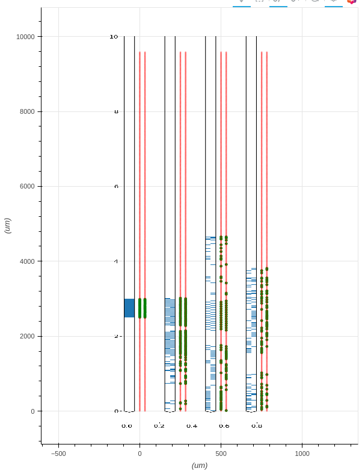

Matplotlib Image View
=====================

**It is an advanced features.** Show dynamic generated image (via ``matplotlib``) as a background image.

Commandline options
-------------------

It doesn't have a standard command-line option.

How to create a view?
---------------------

It has a testing options for demonstrating purpose::

    --view=test:main_image_plt_plot_channelmap:PlotChannelMap

Please check the file ``tests/main_image_plt_plot_channelmap.py``

.. literalinclude:: _static/main_image_plt_plot_channelmap.py
   :language: python
   :lines: 7-34

Run the file directly and load a channelmap file. ::

    python tests/main_image_plt_plot_channelmap.py

