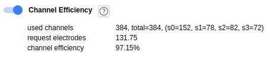

Neuropixels Statistics View
===========================

**It is Neuropixels probe specific feature.**
Calculate some value for a channelmap and a blueprint.

* **used channels**: contains

  * current channel (selected electrode) number
  * total channel number
  * number of channels per shanks.

* **request electrodes**: The request electrode number for pre-selected, full-density, half-density,
  and quarter-density areas.

* **channel efficiency**: The efficiency of channel used. It also can be used to determine the
  compatible a blueprint.

