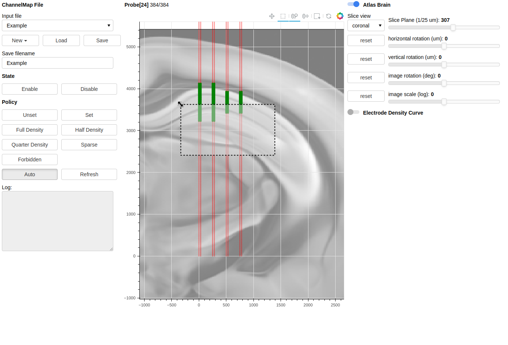
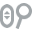

Get Started
===========

Run. ::

    python -m chmap

Then your default web-browser will popup (http://localhost:5006/) with the application.

:warning:
    we tested application in Google Chrome.

:important:
    Do not refresh the web-page.

Commandline options
-------------------

::

    usage: chmap [-h] [-P NAME] [-C PATH] [--atlas NAME] [--atlas-root PATH] [--no-open-browser]

    options:
      -h, --help            show this help message and exit
      -P NAME, --probe NAME
                            use probe family. default use "npx" (Neuropixels probe family).

    Source:
      -C PATH, --chmap-dir PATH
                            channel saving directory

    Atlas:
      --atlas NAME          atlas mouse brain name
      --atlas-root PATH     atlas mouse brain download path

    Bokeh Application:
      --no-open-browser     do not open browser when server starts

Application View
----------------

*   Left panel

    *   Channelmap File

        *   Input (input-text-field).

            Channelmap files lists under `-C PATH`

        *   New/Load/Save

            * New: Create a new channelmap

            * Load: load channelmap from input-text-field.

            * Save: Save current channelmap into output-text-field.

        *   Save (output-text-field)

            saved channelmap filename.

    *   State

        Select/Unselect electrodes that selected by rectangle-tool.

    *   Policy

        Set electrode selection policy for electrodes selected by rectangle-tool.

    *   Log

        application log messages.

*   Middle panel

    *   Probe

        `Probe[CODE] CURRENT/TOTAL`

        where CODE indicates current probe type, TOTAL represents the total channels,
        and CURRENT represents number of electrodes selected as channels.

    *   Tools

        Bokeh provides figure tools, there are:

        * figure pan |bk-tool-icon-pan| (mouse drag): figure view moving.
        * rectangle-tool |bk-tool-icon-box-select| (mouse drag): select electrodes for setting its state and policy.
        * zoom |bk-tool-icon-wheel-zoom| (mouse wheel): figure view zoom
        * wheel |bk-tool-icon-wheel-pan| (mouse wheel): figure view vertical moving
        * image pan |bk-tool-icon-box-edit|: moving background image. (shifted-drag) move/scale image inside the dragged rectangle.
        * reset |bk-tool-icon-reset|: reset figure view
        * hover hint |bk-tool-icon-hover|: display electrode information when mouse moves on electrodes.
        * bokeh |bk-logo-small|: goto bokeh website.

    *   Figures

        *   electrodes

            * black : unselected electrodes
            * green: selected electrodes
            * red: un-select-able electrodes
            * yellow: highlighted electrodes that related to the electrode selected by rectangle-tool.

        *   background image

            Atlas mouse image that controlled by right controls.

        *   rectangle-tool example

*   Right panel

    *   Atlas Brain control groups

        Control image's scaling and rotating. (move controlled by figure-tools)

    *   Electrode Density Curve along shanks

        display electrode density curve (blue) along shanks.

.. |bk-tool-icon-box-edit| image:: _static/bk-tool-icon-box-edit.png

Saved Files
------------

Use Neuropixels probe file format (`*.imro`) as example. Once you save a channelmap with saving name `Example`, then
you will get files under `-C PATH`:

* `Example.imro`: channelmap file
* `Example.policy.npy`: electrode policies matrix
* `Example.config.json`: view configurations of each component, such as the coordinate of atlas mouse image.

Once `Example.imro` load, the other files are also loaded to restore states.
