Get Start
=========

Run. ::

    chmap

Then your default web-browser will popup (http://localhost:5006/) with the application.

:warning:
    we tested application in Google Chrome.

:important:
    Do not refresh the web-page.

Commandline options
-------------------

::

    usage: chmap [-h] [-P NAME] [-C PATH] [--atlas NAME] [--atlas-root PATH] [--no-open-browser]

    options:
      -h, --help            show this help message and exit
      -P NAME, --probe NAME
                            use probe family. default use "npx" (Neuropixels probe family).

    Source:
      -C PATH, --chmap-dir PATH
                            channel saving directory

    Atlas:
      --atlas NAME          atlas mouse brain name
      --atlas-root PATH     atlas mouse brain download path

    Bokeh Application:
      --no-open-browser     do not open browser when server starts

Application View
----------------

.. image:: _static/fig3a.png

*   Left panel

    *   Channelmap File

        *   Input (input-text-field).

            Channelmap files lists under `-C PATH`

        *   New/Load/Save

            * New: Create a new channelmap

            * Load: load channelmap from input-text-field.

            * Save: Save current channelmap into output-text-field.

        *   Save (output-text-field)

            saved channelmap filename.

    *   State

        Select/Unselect electrodes that selected by rectangle-tool.

    *   Policy

        Set electrode selection policy for electrodes selected by rectangle-tool.

    *   Log

        application log messages.

*   Middle panel

    *   Probe

        |probe-desp| `Probe[CODE] CURRENT/TOTAL`

        where **CODE** indicates current probe type, **TOTAL** represents the total channels,
        and **CURRENT** represents number of electrodes selected as channels.

    *   Tools

        Bokeh provides figure tools, there are:

        |figure-toolbar|

        * figure pan |bk-tool-icon-pan| (mouse drag): figure view moving.
        * rectangle-tool |bk-tool-icon-box-select| (mouse drag): select electrodes for setting its state and policy.
        * zoom figure |bk-tool-icon-wheel-zoom| (mouse wheel): figure view zoom
        * wheel figure |bk-tool-icon-wheel-pan| (mouse wheel): figure view vertical moving
        * image pan |bk-tool-icon-box-edit|: moving background image. (shifted-drag) move/scale image inside the dragged rectangle.
        * reset |bk-tool-icon-reset|: reset figure view
        * hover hint |bk-tool-icon-hover|: display electrode information when mouse moves on electrodes.
        * bokeh logo |bk-logo-small|: goto bokeh website.

    *   Figures

        *   electrodes

            * black : unselected electrodes
            * green: selected electrodes
            * red: un-select-able electrodes
            * yellow: highlighted electrodes that related to the electrode selected by rectangle-tool.

        *   background image

            Atlas mouse image that controlled by right controls.

*   Right panel

    *   Atlas Brain control groups. (required extra package. check :ref:`atlas`)

        Control image's scaling and rotating. (move controlled by figure-tools)

    *   Electrode Density Curve along shanks

        display electrode density curve (blue) along shanks.

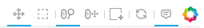
.. |bk-tool-icon-pan| image:: _static/bk-tool-icon-pan.svg
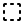

.. |bk-tool-icon-wheel-pan| image:: _static/bk-tool-icon-wheel-pan.png
.. |bk-tool-icon-box-edit| image:: _static/bk-tool-icon-box-edit.png
.. |bk-tool-icon-reset| image:: _static/bk-tool-icon-reset.svg
.. |bk-tool-icon-hover| image:: _static/bk-tool-icon-hover.svg
.. |bk-logo-small| image:: _static/bk-logo-small.png

Build your first channelmap
---------------------------

A simple channelmap
~~~~~~~~~~~~~~~~~~~

1.  Press **New** and choose a probe type to create/reset an empty channelmap.

    |new-probe|

2.  Move the probe (shown in electrodes) to the proper place.
3.  Use rectangle-tool in the figure toolbar to select electrodes.

    |rect-select-tool|

    Selected electrodes will be kept in black and highlighted in yellow, and other electrodes will be faded.

    Other electrodes are also highlighted in yellow, which indicates they will be unable to be selected,
    according to Neuropixels' hardware restriction.

    |rect-select-electrodes|

4.  Click **Enable** to set the selected electrodes as readout channels.

    |enable-electrodes|

    The yellow highlighted electrodes, except the selected ones, will disappear.
    However, they are still selectable and will overwrite the previous ones when they are enabled.

    before: |rect-select-electrodes-overwrite| after: |rect-select-electrodes-after|

5.  Repeat picking until text becomes |probe-desp| at the top of the figure.
6.  Type the new filename for your channelmap in **Save filename** field.

    |save-map|

7.  Press **Save**.

    You will see the messages in **Log** said files are saved.

    |save-log|

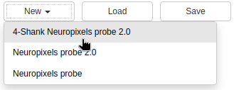
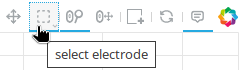
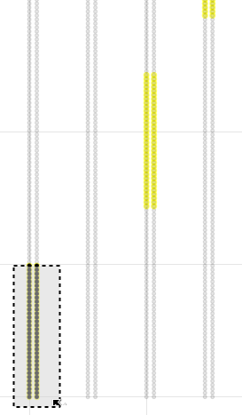
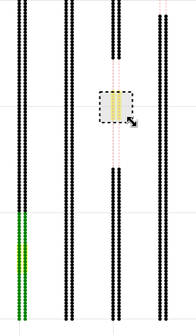
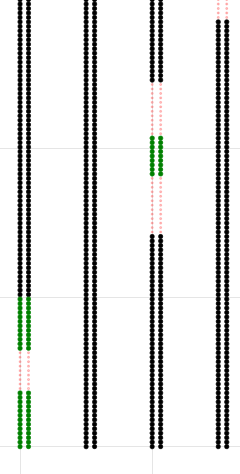
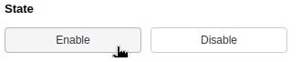
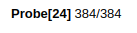
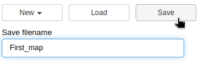
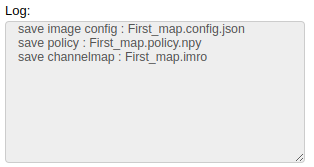

Saved Files
~~~~~~~~~~~

Once you save a channelmap (use previous example), then you will get files under `-C PATH`:

* `First_map.imro`: channelmap file
* `First_map.policy.npy`: electrode policies matrix
* `First_map.config.json`: view configurations of each component, such as the coordinate of atlas mouse image.

Once `First_map.imro` load, the other files are also loaded to restore states.

A custom channelmap
~~~~~~~~~~~~~~~~~~~

1.  Press **New** and choose a probe type to create/reset an empty channelmap.
2.  (optional) Move and adjust the atlas image to proper view according to your experimental goal.

    For example, I want to record signals from the Hippocampus.

    1.  Change **Slice view** to *coronal*. |atlas-slice|
    2.  Move **Slice Plane** to *290*.
    3.  Adjust other setting if needed.
    4.  use box-edit at the figure toolbar to move the atlas image
        to the proper position that the probe passes through the Hippocampus.

        |box-edit-tool-hinted|

3.  Move the probe (shown in electrodes) to the proper place.

    |atlas-image-probe|

4.  Use rectangle-tool |bk-tool-icon-box-select| in the figure toolbar to select electrodes in a particular area,
    then press one of the buttons in **Policy**.

    |policy-full-density|

    In this step, rather than directly selecting electrodes as readout channels, we set an arrangement policy for selected electrodes.
    Following the policy setting (we called it a blueprint), the application will generate a channelmap.

    There are recommended steps for building a blueprint.

    1.  Set electrodes outside the brain with **forbidden** policy, so forbidden electrodes are never selected.

        select |electrodes-outside| set |forbidden|

    2.  Set electrodes around the regions of interest (Hippocampus structure here) with **Set** or **Full Density** policy.

        |roi|

    3.  Set the other electrodes with a policy.
    4.  A valid channelmap will be updated automatically |auto|.

5.  Check text becomes |probe-desp| at the top of the figure.

    |custom-chmap|

    If not, it means the current blueprint isn't compatible with the Neuropixels's hardware restriction. Please check `tips`_

6.  Type the new filename for your channelmap in **Save filename** field.
7.  Press **Save**.

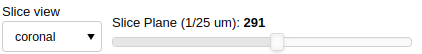
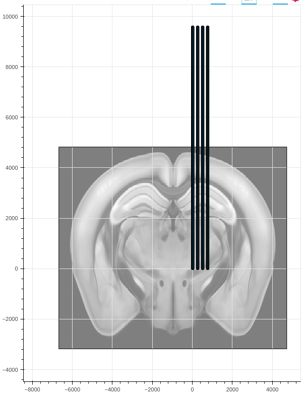
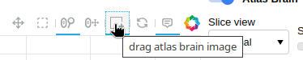
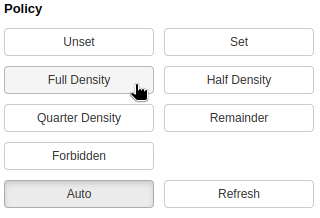
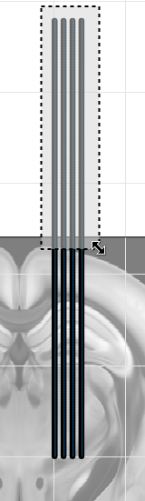
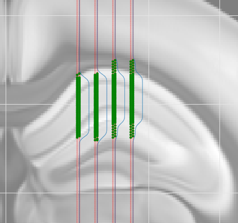
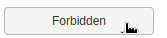
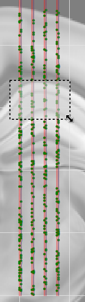
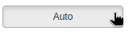

.. _tips:

Tips on building custom channelmap
~~~~~~~~~~~~~~~~~~~~~~~~~~~~~~~~~~

TODO

